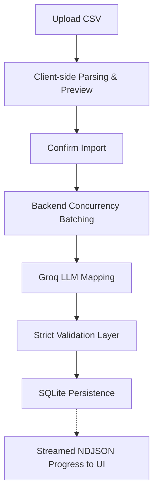

# GrowEasy AI CSV Importer

**Live Frontend:** https://groweasy.pranavx.in/

**Live Backend:** https://groweasy-csv-importer-1-2lm0.onrender.com


## Table of Contents
1. [What It Does](#what-it-does)
2. [How It Works](#how-it-works)
3. [Design Decisions](#design-decisions)
4. [Tech Stack](#tech-stack)
5. [Project Structure](#project-structure)
6. [Local Setup](#local-setup)
7. [API Documentation](#api-documentation)

## What It Does
A full-stack application that allows users to upload any arbitrary CSV file and instantly map it into the strict GrowEasy CRM schema. It uses an LLM to intelligently infer column mappings, extract contact details, enforce enums, and coerce data types regardless of the original CSV's layout or language.

## How It Works
The system follows a strict, safe pipeline to guarantee data integrity before anything reaches the database.



## Design Decisions
- **Batching with Concurrency Cap:** Instead of sending 5,000 rows to the LLM at once (which guarantees a timeout or hallucination), the backend processes rows in strict chunks of 18. It uses a custom asynchronous pool to run up to 3 batches concurrently, maximizing Groq's rate limits while preventing overload.
- **NDJSON Streaming vs Polling:** The API uses `text/event-stream` to send newline-delimited JSON chunks back to the client as each batch finishes. This is vastly superior to client-side polling because it reduces network overhead and provides a perfectly smooth, real-time progress bar.
- **Retry-with-Backoff:** LLMs can occasionally return malformed JSON or fail to respond. The system implements an automatic retry mechanism (up to 2 extra attempts with a 500ms exponential backoff) on a per-batch level, ensuring a single bad batch doesn't abort the entire 5,000-row import.
- **Validation as a Safety Net:** LLMs are non-deterministic. The `validator.ts` layer sits *between* the LLM and the database. It strictly enforces the 4 allowed `crm_status` enums, coerces timestamps, and cleanly strips invalid data. We never trust raw LLM output.
- **SQLite Persistence:** While the original spec allowed for a stateless import, I implemented a full Prisma + SQLite database. This demonstrates a production-ready persistence layer without complicating the local setup (no Postgres required).

## Tech Stack
- **Frontend:** Next.js 16 (App Router), React, Tailwind CSS, Lucide Icons, `@tanstack/react-virtual`
- **Backend:** Node.js, Express 5, Prisma (SQLite), Groq SDK
- **AI Processing:** Llama 3.3 70B via Groq

## Project Structure
The repository is structured as a professional monorepo to clearly separate concerns:
- `/frontend`: The Next.js client, containing all UI components, CSV parsing (`PapaParse`), and streaming API logic.
- `/backend`: The Express server, housing the Groq integration, concurrent batching service, and SQLite database.
- `/sample-data`: Assorted messy CSVs for testing the AI mapping engine.

## Local Setup

### 1. Backend Setup
The backend requires a Groq API key and runs a local SQLite database for persistence.

```bash
cd backend
cp .env.example .env
# Edit .env and add your GROQ_API_KEY
npm install
npx prisma generate
npx prisma db push
npm run dev
```

### 2. Frontend Setup
The frontend connects to the backend API.

```bash
cd frontend
cp .env.example .env.local
npm install
npm run dev
```
Open `http://localhost:3000` to view the app.

## API Documentation

### `POST /api/import`
Accepts a batch of raw JSON rows and streams back processed records mapped to the CRM schema.

**Request:**
```json
{
  "rows": [
    {
      "Full Name": "Pranav Gawai",
      "Contact Details": "pranav@example.com, 98765-43210",
      "Lead Status": "Won"
    }
  ]
}
```

**Query Parameters:**
- `?stream=1` (optional): If provided, returns newline-delimited JSON (NDJSON) progress events.

**Response (NDJSON Stream):**
```json
{"type":"start","totalRows":1,"totalBatches":1}
{"type":"progress","completedBatches":1,"totalBatches":1}
{"type":"done","result":{"records":[{"created_at":null,"name":"Pranav Gawai","email":"pranav@example.com","country_code":null,"mobile_without_country_code":"98765-43210","company":null,"city":null,"state":null,"country":null,"lead_owner":null,"crm_status":"SALE_DONE","crm_note":null,"data_source":"","possession_time":null,"description":null}],"skipped":[],"totalRows":1,"totalImported":1,"totalSkipped":0}}
```
